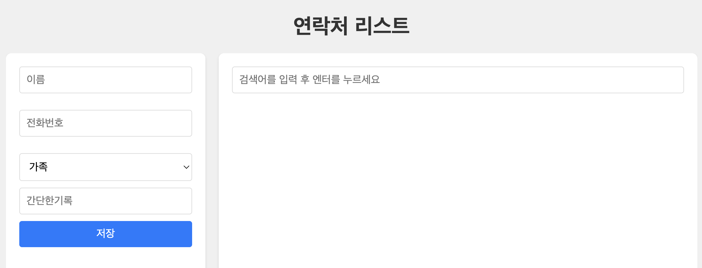

# React + TypeScript를 사용하여 Phonebook List 만들어보기

 <br>

기능설명

- 사용자가 이름, 전화번호, 그룹, 간단한 메모를 포함한 연락처를 추가, 조회, 삭제할 수 있습니다.
- 저장된 연락처를 이름이나 전화번호로 검색할 수 있으며, 결과가 없을 경우 알림을 표시합니다.
- 연락처 정보는 로컬 스토리지에 저장되어 브라우저를 닫았다 열어도 유지되며, 반응형 디자인으로 다양한 기기에서 사용 가능합니다.

## 구현 내용

- Contact 정보 구조 : Contact를 인터페이스로 정의하여 이름, 전화번호, 그룹, 간단한 메모를 타입으로 지정

```
interface Contact {
    id: number;
    name: string;
    phone: string;
    group: string;
    shortDesc: string;
}
```

사용자가 이름, 전화번호, 그룹, 간단한 메모를 포함한 연락처를 추가할 수 있는 기능

```
// App.tsx

const [contacts, setContacts] = useState<Contact[]>([]);

const addContact = (newContact: Omit<Contact, "id">) => {
    const contact = { ...newContact, id: Date.now() };
    setContacts([...contacts, contact]);
};

<ContactForm onAddContact={addContact} />
```

- addContact 함수는 ContactForm.tsx에서 입력된 새로운 연락처 데이터를 받아 연락처 목록에 추가하는 역할을 한다
- newContact는 연락처의 세부 정보 (name, phone, group, shortDesc)를 전달받고, 여기에 고유한 id를 추가한 후, setContacts를 사용하여 기존 연락처 목록에 새로운 연락처를 추가한다.
- App.tsx에서 ContactForm 컴포넌트에 addContact 함수가 onAddContact이라는 이름의 props로 전달.

```
// ContactForm.tsx

interface ContactFormProps {
  onAddContact: (contact: Contact) => void;
}

const [contact, setContact] = useState<Contact>({
    name: "",
    phone: "",
    group: "가족",
    shortDesc: "",
});

const handleChange = (
    e: React.ChangeEvent<HTMLInputElement | HTMLSelectElement>
  ) => {
    const { name, value } = e.target;
    setContact({ ...contact, [name]: value });

    // 이름과 전화번호의 유효성을 검사하고 에러 메시지를 설정
    if (name === "name") {
      setErrors((prev) => ({ ...prev, name: validateName(value) }));
    } else if (name === "phone") {
      setErrors((prev) => ({ ...prev, phone: validatePhone(value) }));
    }
};

const handleSubmit = (e: React.FormEvent) => {
e.preventDefault();
const nameError = validateName(contact.name);
const phoneError = validatePhone(contact.phone);

if (nameError || phoneError) {
    setErrors({ name: nameError, phone: phoneError });
    return;
}

onAddContact(contact);
setContact({ name: "", phone: "", group: "가족", shortDesc: "" });
setErrors({});
};
```

- ContactForm.tsx에서 연락처 입력에 필요한 contact 상태가 초기화한다. 이 상태는 사용자가 폼에 입력한 연락처 정보를 저장한다. 초기 상태는 빈 값으로 설정되며, 그룹은 기본값으로 "가족"이 설정되어 있다.
- 사용자가 이름, 전화번호, 그룹, 간단한 메모를 폼에 입력할 때마다 handleChange라는 함수가 실행되어 입력값이 contact 상태에 실시간으로 반영된다. handleChange 함수는 setContact를 통해 각 입력 필드의 값을 업데이트하는 역할을 한다.
- 마지막으로 handleSubmit 함수가 실행되어 입력값을 유효성 검사한. 입력값이 올바르다면, onAddContact를 호출하여 상위 컴포넌트로 데이터를 전달한다